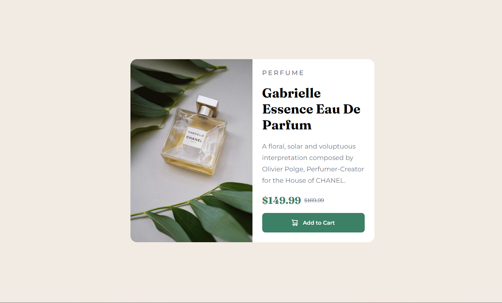
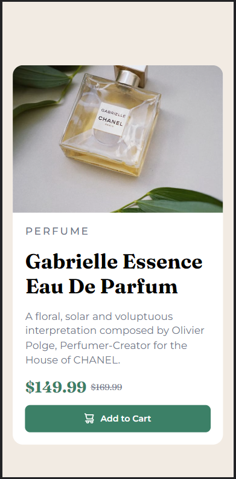

# Frontend Mentor - Product preview card component solution

This is a solution to the [Product preview card component challenge on Frontend Mentor](https://www.frontendmentor.io/challenges/product-preview-card-component-GO7UmttRfa). Frontend Mentor challenges help you improve your coding skills by building realistic projects. 

## Table of contents

- [Overview](#overview)
  - [The challenge](#the-challenge)
  - [Screenshot](#screenshot)
  - [Links](#links)
- [My process](#my-process)
  - [Built with](#built-with)
  - [What I learned](#what-i-learned)
  - [Continued development](#continued-development)
  - [Useful resources](#useful-resources)
- [Author](#author)

## Overview

### The challenge

Users should be able to:

- View the optimal layout depending on their device's screen size
- See hover and focus states for interactive elements

### Screenshot

### Links

- Solution URL: [Add solution URL here](https://your-solution-url.com)
- Live Site URL: [Add live site URL here](https://your-live-site-url.com)

## My process
  Started with a Desktop-first approach inhind sight I 
  dont think that was a good decision as it lead to me experiencing some issues which I resolved my further studying how fonts work.

### Built with

- Semantic HTML5 markup
- CSS custom properties
- Flexbox
- CSS Grid

### Continued development

I still find it a bit difficult to get the height of the card to fit inside the body ,I ended up using a fixed height for the desktop view

### Useful resources

- [KEvin Powell's:Why you shouldn't set font-sizes using em](https://www.youtube.com/watch?v=pautqDqa54I&t=5s) - HElped me understand how I should go about using fonts and when and where to use rem and em.

## Author

- Frontend Mentor - [@MackenanDsouza](https://www.frontendmentor.io/profile/MackenanDsouza)

